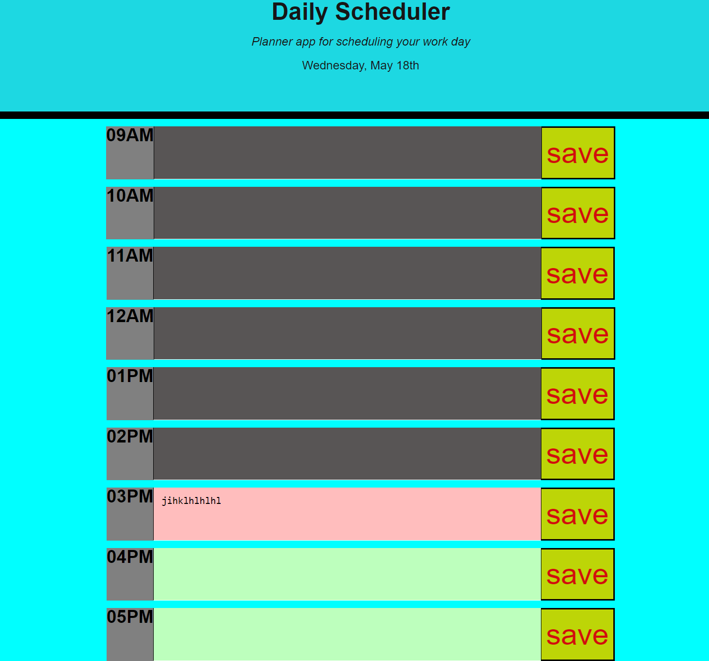

# Day-Planner
a daily planner that  uses moment api to help with dates and hours that are set between 9-5pm. By inputting a small descriptive information in the text box and clicking the save button, the information will stored locally that can be retrieved later.

### Deployed Link
https://xbaderm.github.io/Day-Planner/

### Screenshot
